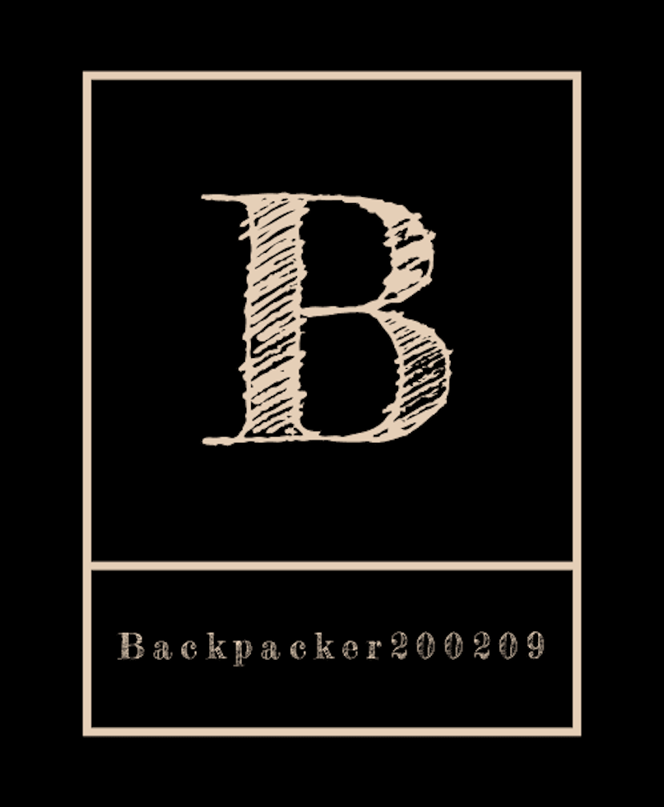
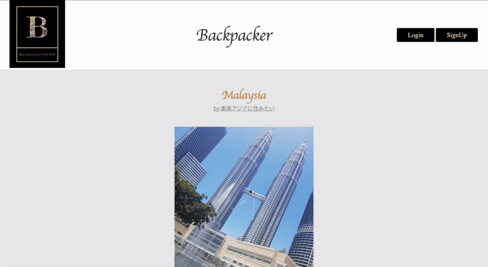

<h2 align="center">BACKPACKER200209</h2>

  

 

  

 
 

## 📷  App URL

### **https://backpacker21.herokuapp.com/**  
 

ログイン用アカウント  
メールアドレス：tounan@com  
パスワード：tounan1

 

### 
構築方法

$ git clone https://github.com/aocattleya/hoge.git  

$ cd hoge  

$ bundle install  

$ rails db:create  

$ rails db:migrate  

$ rails s

👉 http://localhost:3000

 

## 🌏  制作背景
自分がバックパッカーという経験で非常に良い思い出を作ることができ、人としても成長できたので、他の方にも同じような経験をしてもらいたい、という思いがありました。  
何も情報がないから不安で行けないという人が身の回りに多かったことから、他にもこのような方がいるのではないかと思い、海外の情報を共有できるようなサイトを作ろうと思ったことがきっかけです。  
 

### 制作背景の詳細
2020年の2月から1ヶ月間で、自分にとっては初めての海外でしたが、バックパッカーという形で、ベトナム、ラオス、タイ、マレーシアの4カ国に行きました。  

日本からベトナムへの行きと、マレーシアから日本への帰りの飛行機しか取らず、泊まる宿も毎日現地で見つけました。  
バスの時刻表などもなく、現地の方にお聞きし、20時間バスに乗って国境を渡るなどして、最初に到着したベトナムから、観光や様々な物に触れながら、帰りの飛行機を予約しているマレーシアまで辿り着きました。  

1日300円の宿や、多国籍の方と同じ部屋に泊まり、得するような換金所を探し、料理や商品、交通費の値段交渉をするなどして、少ない資金で様々な体験をすることができました。
荷物はリュック1つだけで、洋服は3着を洗濯して着回し、不必要になり今後も使わないと思ったものはその場で処分し、必要なものは現地調達をしました。  
実際に行ってみて辛いこともありましたが、非常に楽しく、人としての成長にも繋がりました。  

行く前に友達などに行くことを伝えたのですが、初めての海外としては挑戦的ということもあり、辞めときな、できないでしょ、何を考えてるの、などの批判や心配の声が多かったです。  
行っている最中にSNSで状況を発信したり、帰ってきた後にエピソードを話したところ、すごい、楽しそう、行ってみたい、などの声に変わりました。  
ですが、情報量が少なく何もわからないから不安の方が強いという理由で、断念してしまっている人が多かったです。たしかに、情報量が少なくて困る場面は何度もありました。  

そこで、情報さえ得ることができれば行ける人も増え、自分は本当に楽しかったですし、人として成長できたので、他の方にもこの経験をして貰いたい、という思いから、今回のアプリを作りました。  

ペルソナとしては、  
性別は問わず  
年齢は主に学生  
世界中の方  
を対象としています。  

理由としては、お金を持っている大人は、バックパッカーという形ではなく旅行という形で行くことができますが、学生でそこまでお金に余裕がある人は少ないことに加えて、自由に旅行に行くことができるのは学生であり、若いうちに自分のような経験をして貰いたいからです。  
自分もそうでしたが、学校のある期間にお金を貯め、情報を集め、長期休みに海外に行くことを想定しております。  

性別に関しては、自分が実際に行き、何人ものバックパッカーの方にお会いしましたが、男性の方が多かったです。  
安全性の問題もあると思いますが、正しい情報を得て対策をした上であれば問題ないと思いますので、是非女性の方にも行って貰いたいという思いから性別は問いませんでした。  
 
 

## 🌎  概要
このアプリでは、自分が行きたい国や街に関する情報を得ること、行きたい国を探すことができます。  
載っている情報は、実際に行った方々が載せている情報であり、旅行サイトや本などには載っていないマニアックな情報やタイムリーな情報を得ることができます。  

例としては、おすすめ度、安全性、英語は通じるのか、おすすめの換金所、宿の値段や評価、交通手段、安く済ます方法などです。  
下記の動画は詳細ページです。  
 

  

  
上から、行った国、写真、おすすめ度、安全度、行った街、行った日にち、英語が通じるのか、自由記事となっています。  
 
 
下記の動画のように検索機能もあり、国名を入れると該当する記事が出てきます。  
 
 

  

  
ユーザーは投稿することもでき、母国の事を載せるだけでも、他国の人からしたら貴重な情報ですので、投稿のハードルも高くなく気軽に投稿でき、自分の経験を共有することができます。  
 
 
下記の写真のように投稿者にコメントで質問することができ、投稿者も質問に関して返信機能から応えることができ、より踏み込んだ情報を得ることができます。  
 
 

  

 
下記の動画はユーザーページです。
ユーザーが投稿した記事が載っています。
  

  

 
 

## 🌍  工夫したポイント
1番工夫した点は、実装に最も時間がかかったコメントに対する返信機能です。  
このアプリの目的である情報を得るということにおいて、投稿者と閲覧者が話すことができる場合とできない場合では便利さが大きく変わっていくると思い、時間をかけてまで実装しました。  

気軽に情報を得る事に重きを置いているので、新規登録もユーザー名、メールアドレス、パスワードの3つにし、投稿も必須の部分は、選択制にし、文だけでは伝わらない為、複数の写真を投稿できるようにしました。  

世界中の方を対象としているので、行った国、都市や街は英語にし、検索も英語にしました。  
慣れないと不便を感じるかもしれませんが、情報量も大事にしたかった為このようにしました。  
自由記事では言語は問わず、Google Chromeなどの翻訳機能を使うことで読むことが可能になるので、投稿のハードルを下げて情報を共有し易くする意味でも、このようにしました。  
 
 

## 🌏  課題や今後実装したい機能
6点御座います。  

・現段階では、投稿者がコメントで質問されたこと、質問者が返信を受けたことが投稿をいちいち見ないとわからない為、通知機能をつけたいと思っています。  
・一個のコメントに対して複数人会話に参加した際に、どのユーザーへの返信なのかがわかりずらいので、表示方法を変えて紐付いているコメント同士をわかりやすくいしたいと思っています。  
・コメントでの質問に対して、必要に応じて写真も送ることができるように、コメントで写真を送信できる機能もつけたいと思っています。  
・編集において写真の編集ができないようになっているので、その点も改善したいと思っています。  
・写真の選択するボタンが日本語になっていますので、CSSをうまく使い英語表記にしたいと思っています。
・自由な記事に長文を書いた場合、改行ができていないので、見づらい点も改善したいと思っています。

 
 

## テーブル設計
 

### users テーブル

| Column             | Type     | Options                   |
| ------------------ | ------   | -----------               |
| nickname           | string   | null: false               |
| email              | string   | null: false, unique: true |
| encrypted_password | string   | null: false               |

 

### Association

- has_many :articles
- has_many :comments

 

### articles テーブル

| Column       | Type        | Options                        |
| ------       | ------      | -----------                    |
| country      | integer     | null: false                    |
| season       | string      | null: false                    |
| city         | string      | null: false                    |
| english_id      | string      | null: false                    |
| nice_id         | integer     | null: false                    |
| safe_id  | string      | null: false                    |
| content      | text        | null: false                    |
| user         | references  | null: false, foreign_key: true |

 

### Association

- belongs_to :user
- has_many   :comments

 

### comments テーブル

| Column       | Type       |Options                           |
| ------       | ---------- | ------------------------------   |
| comment      | text     | null: false                      |
| user         | references | null: false, foreign_key: true   |
| article         | references | null: false, foreign_key: true   |

 

### Association

- belongs_to :user
- belongs_to :article

 

### replies テーブル

| Column       | Type       |Options                           |
| ------       | ---------- | ------------------------------   |
| reply        | text       | null: false                      |
| user         | references | null: false, foreign_key: true   |
| comment         | references | null: false, foreign_key: true   |

 

### Association

- belongs_to :user
- belongs_to :comment

